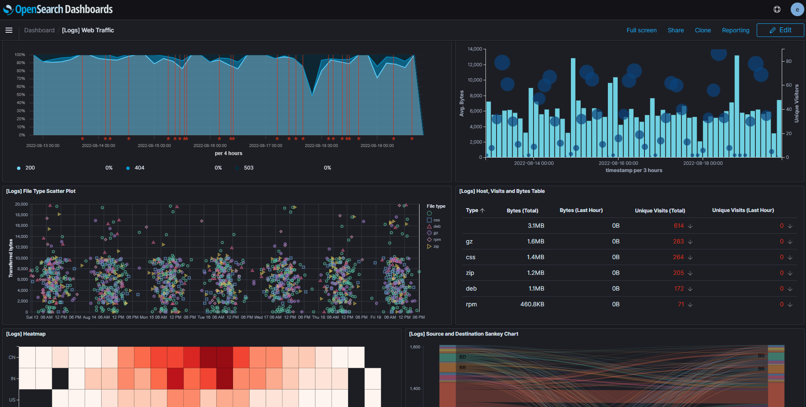

# AWS OpenSearch

OpenSearch can receive streaming data form a variety of sources:


## Create the environment

Create the variables file:

```sh
touch .auto.tfvars
```

Prepare the variables:

```hcl
region               = "sa-east-1"
master_user_name     = "elasticuser"
master_user_password = "P4ssw0rd#"
```

Create the infrastructure:

```sh
terraform init
terraform apply -auto-approve
```

Once done the cluster should be available and ready to load sample data.



## Stream Data from S3

This example is copied from [Loading streaming data from Amazon S3](https://docs.aws.amazon.com/opensearch-service/latest/developerguide/integrations.html#integrations-s3-lambda) tutorial.

You'll need to create a Lambda to read objects from S3 and send streaming to OpenSearch.

Start by installing the dependencies:

```
cd s3-to-opensearch

pip install --target ./package requests
pip install --target ./package requests_aws4auth
```

Now package the application:

```sh
cd package
zip -r ../lambda.zip .

cd ..
zip -g lambda.zip sample.py
```

Create the Lambda function:
1. S3 trigger
2. Choose your bucket
3. Event type: PUT
4. Prefix: `logs/`
5. Suffix: `.log`
6. Acknowledge recursive invocation and add it

Also add the environment variables `AWS_REGION` and `OPENSEARCH_HOST` that are used by the Python script.

Finally, you can upload your deployment package:

1. Choose Upload from and .zip file, then follow the prompts to upload your deployment package.
2. After the upload finishes, edit the Runtime settings and change the Handler to sample.handler. This setting tells Lambda the file (sample.py) and method (handler) that it should run after a trigger.

Now upload file [sample.log](s3-to-opensearch/sample.log) to S3 in the `logs` folder..

---

### Clean-u;

Delete the Lambda function.

Run `terraform destroy -auto-approve`
