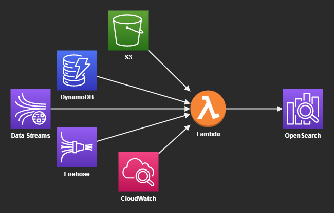

# AWS OpenSearch

OpenSearch can receive streaming data form a variety of sources:



## Create the environment

Create the variables file:

```sh
touch .auto.tfvars
```

Prepare the variables:

```hcl
region               = "sa-east-1"
master_user_name     = "elasticuser"
master_user_password = "P4ssw0rd#"
```

Create the infrastructure:

```sh
terraform init
terraform apply -auto-approve
```

Once done the cluster should be available and ready to load sample data.


